# 💰 Analyzing E-Commerce Business Performance with SQL

Tool : PostgreSQL
Visualization : Microsoft Excel
Dataset : Rakamin Academy - Ecommerce Data

Table of Contents

STAGE 0: Problem Statement
Background Story
Objective
STAGE 1: Data Preparation
Create Database and ERD
STAGE 2: Data Analysis
Annual Customer Activity Growth
Annual Product Category Quality
Annual Payment Type Usage
STAGE 3: Summary

## 📂 STAGE 0: Problem Statement
### Background Story
Mengukur performa bisnis merupakan suatu hal yang sangat penting bagi sebuah perusahaan. Ini akan membantu dalam memantau, dan menilai keberhasilan atau kegagalan dari berbagai proses bisnis. Pengukuran performa bisnis dapat dilakukan dengan memperhitungkan beberapa metrik bisnis. Dalam poyek ini akan dilakukan analisis performa bisnis suatu perusahaan eCommerce dengan dengan metrik bisnis yaitu pertumbuhan pelanggan, kualitas produk, dan tipe pembayaran berdasarkan historical data selama tiga tahun.

### Objective
Mengumpulkan insight dari analisis dan dengan visualisasi berupa :

1.  Annual Customer Activity Growth
2. Annual Product Category Quality
3. Annual Payment Type Usage

## 📂 STAGE 1: Data Preparation
Dataset yang digunakan adalah dataset sebuah perusahaan eCommerce Brasil yang memiliki informasi pesanan dengan jumlah 99441 dari tahun 2016 hingga 2018. Terdapat fitur-titur yang membuat informasi seperti status pemesanan, lokasi, rincian item, jenis pembayaran, serta ulasan.

### Create Database and ERD
#### Langkah-langkah yang dilakukan meliputi:

1. Membuat workspace database di dalam pgAdmin dan membuat tabel menggunakan CREATE TABLE statement
2. Melakukan import data csv kedalam database
3. Menentukan Primary Key atau Foreign Key enggunakan statement ALTER TABLE
4. Membuat dan mengeksport ERD (Entity Relationship Diagram)
Click untuk melihat Queries
Hasil ERD :
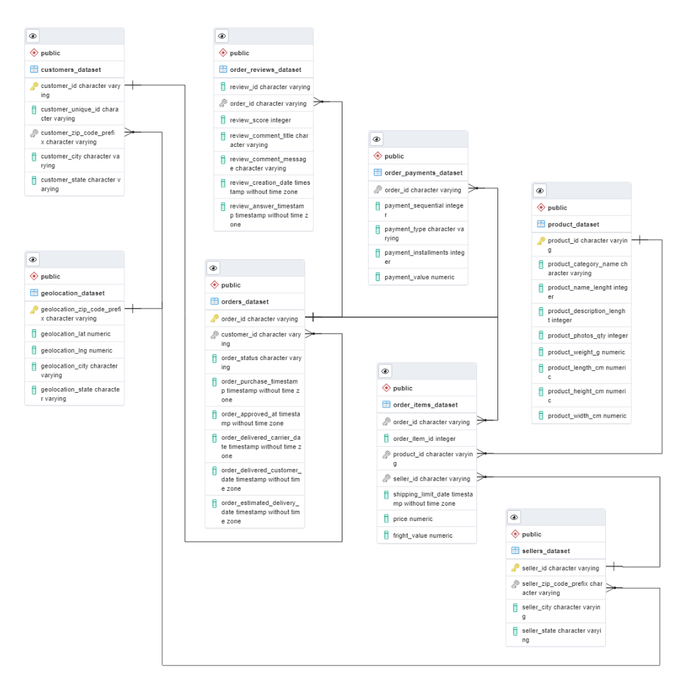

Gambar 1. Entity Relationship Diagram

## 📂 STAGE 2: Data Analysis
1. Annual Customer Activity Growth
Pertumbuhan aktivitas pelanggan tahunan dapat dianalisis dari Monthly active user (MAU), pelanggan baru, pelanggan dengan repeat order, dan rata-rata order oleh pelanggan.

Click untuk melihat Queries
Tabel 1. Hasil Analisis Pertumbuhan Aktivitas Pelanggan Tahunan
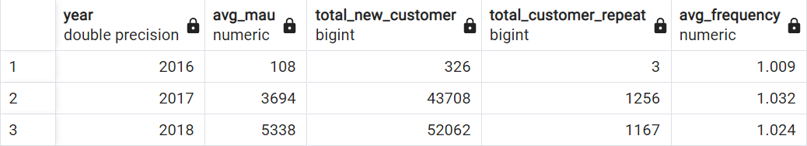

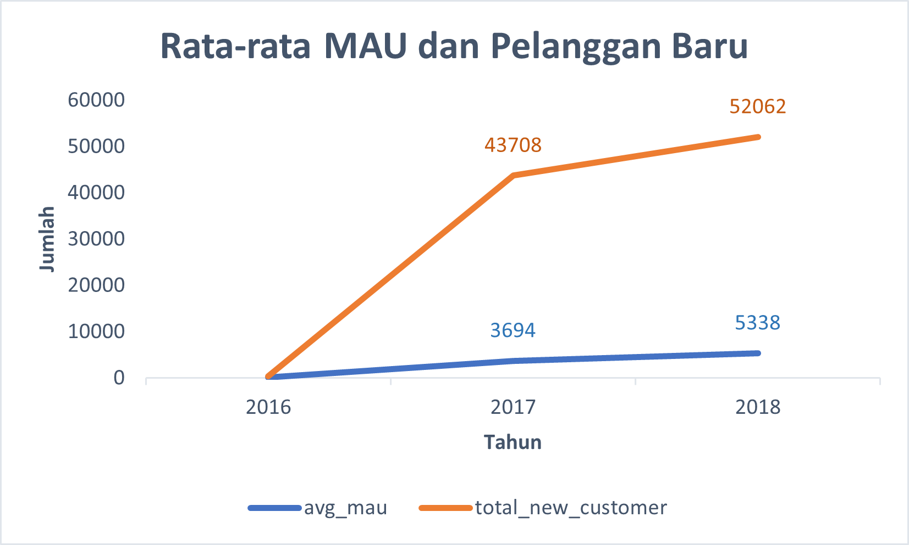
Gambar 2. Grafik Rata-rata MAU dan Pelanggan Baru

Secara keseluruhan perusahaan mengalami peningkakatan Monthly Active User serta pelanggan baru setiap tahunnya. Peningkatan yang signifikan terjadi pada tahun 2016 ke 2017, hal ini dikarenakan data transaksi pada tahun 2016 dimulai pada bulan September.

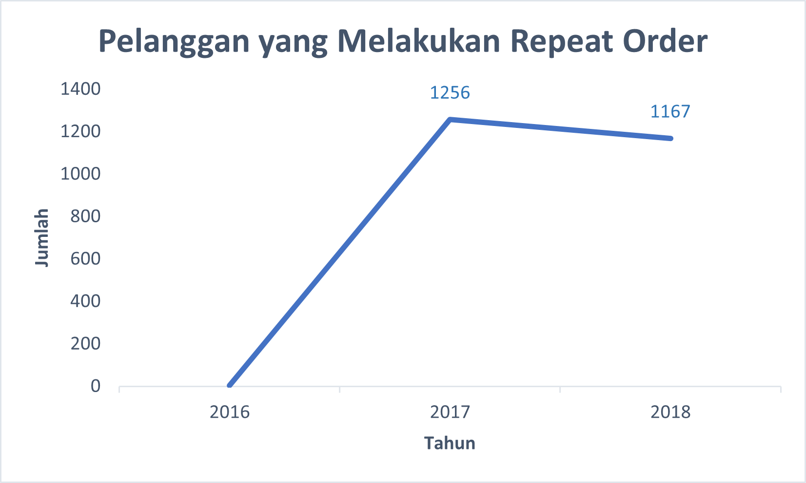
Gambar 3. Grafik Jumlah Pelanggan yang Melakukan Repeat Order

Peningkatan yang signifikan juga terjadi pada jumlah pelanggan yang melakukan repeat order pada tahun 2016 hingga 2017. Namun pada tahun 2018 mengalami sedikit penurunan.

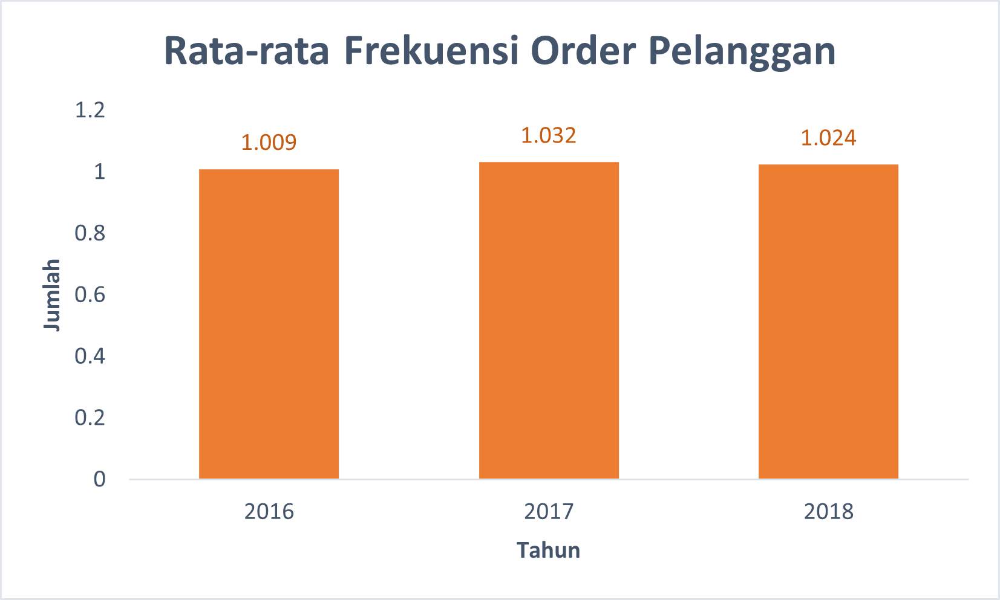
Gambar 4. Grafik Rata-rata Frekuensi Order Pelanggan

Dari analisis dan grafik diatas dapat diketahui bahwa rata-rata pelanggan setiap tahunnya cenderung hanya melakukan order satu kali, artinya mayoritas pelanggan tidak melakukan repeat order.

## 2. Annual Product Category Quality
Kualitas kategori produk tahunan dapat dianalisis dari total pendapatan, total pembatalan pesanan, kategori top produk dan kategori produk yang paling banyak dibatalkan.

Click disini untuk melihat Queries
Tabel 2. Hasil Analisis Total Kategori Produk Tahunan
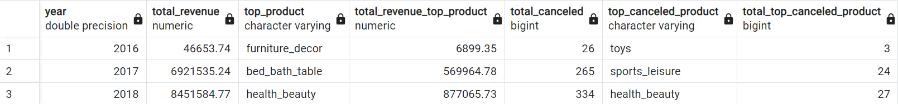

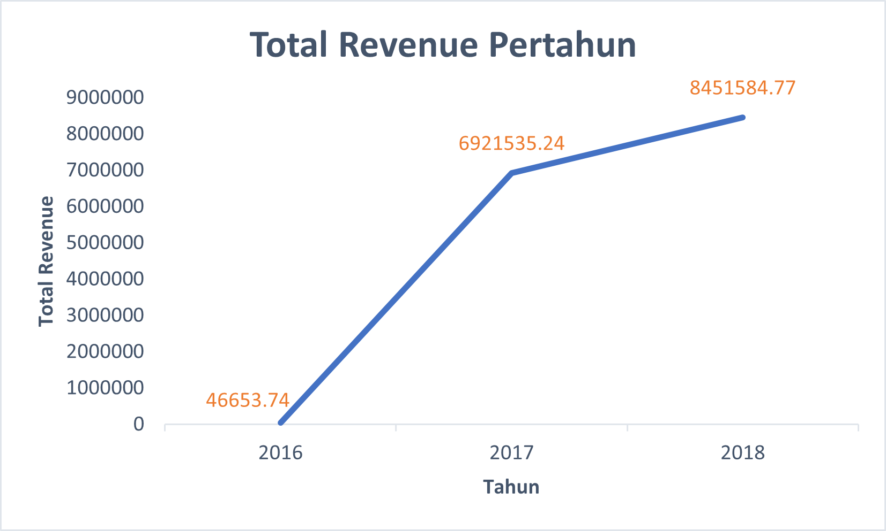
Gambar 5. Grafik Total Revenue Pertahun

Secara keseluruhan revenue perusahaan meningkat setiap tahun.

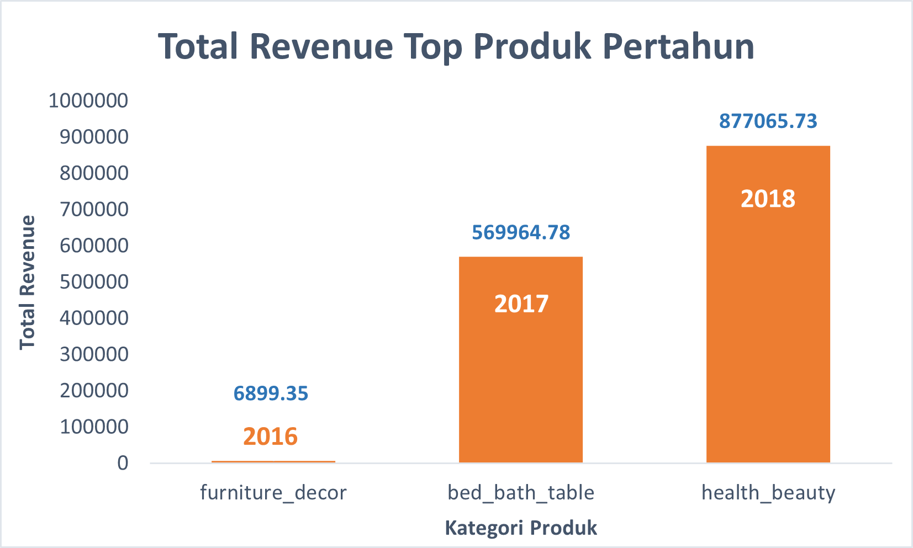
Gambar 6. Grafik Total Revenue Top Produk Pertahun

Revenue yang dihasilkan dari top produk juga meningkat untuk setiap tahunnya. Selain itu setiap tahunnya memiliki jenis kategori top produk yang berbeda. Pada tahun 2018, perusahaan menghasilkan revenue paling tinggi dengan jenis karegori top produk kesehatan dan kecantikan (health_beauty).

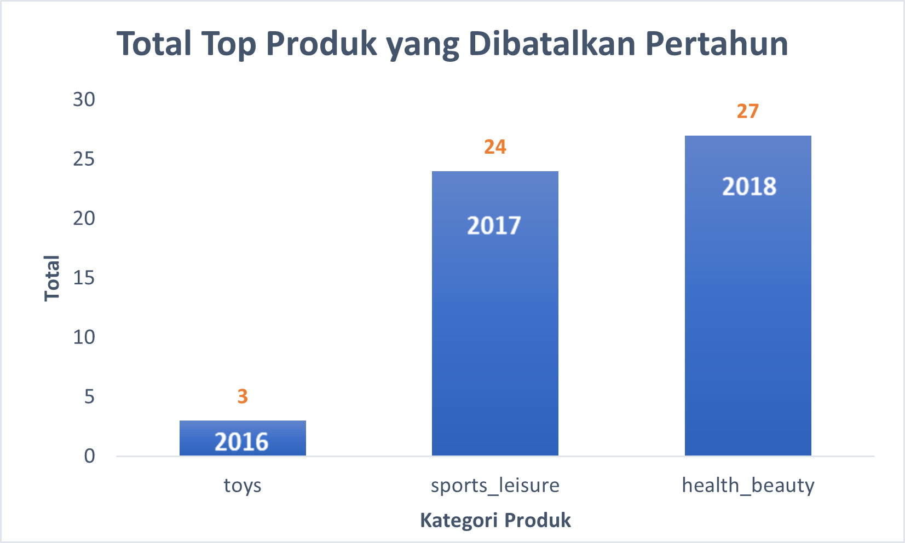
Gambar 7. Grafik Total Revenue Top Produk Pertahun

Produk yang sering dibatalkan oleh pelanggan untuk setiap tahunnya juga memiliki jenis kategori yang berbeda dan terus mengalami kenaikan. Tahun 2018 memiliki jumlah produk yang dibatalkan paling banyak dan memiliki jenis kategori yang sama dengan top produk yang paling banyak menghasilkan revenue. Hal tersebut dapat diduga karena jenis kategori kesehatan dan kecantikan sedang mendominasi pasar.

## 3. Annual Payment Type Usage
Tipe pembayaran yang digunakan pelanggan dapat dianalisis dari jenis pembayaran favorit dan jumlah penggunaan untuk setiap jenis pembayaran pertahun.

Click untuk melihat Queries
Tabel 3. Hasil Analisis Tipe Pembayaran yang Digunakan Pelanggan
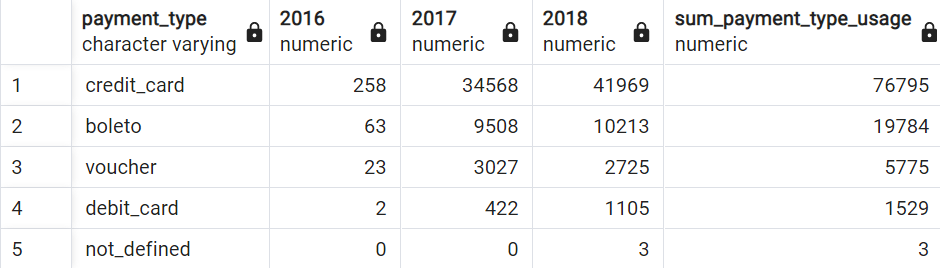

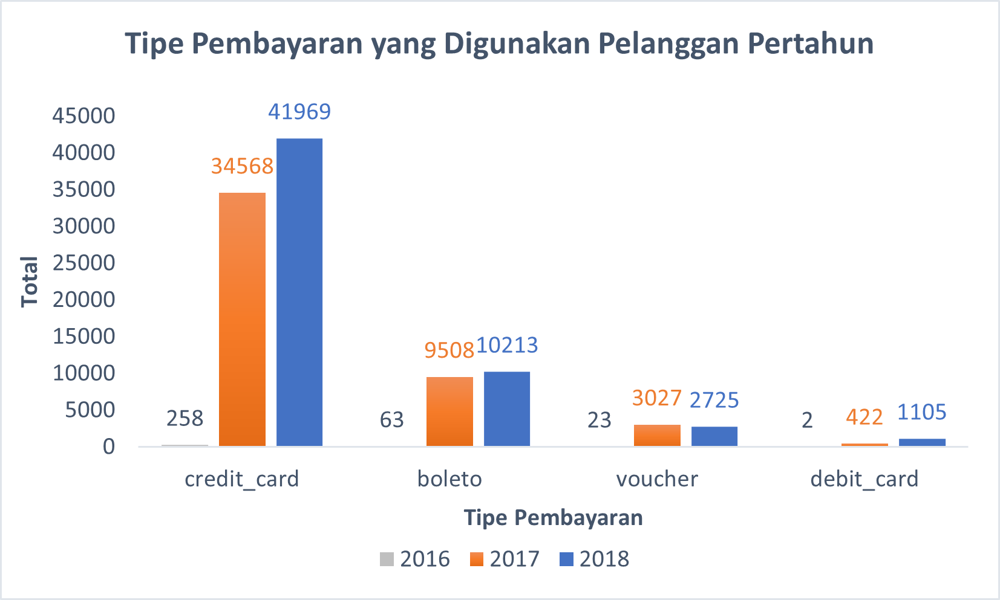
Gambar 8. Grafik Tipe Pembayaran yang Digunakan Pelanggan Pertahun

Mayoritas pelanggan melakukan pembayaran menggunakan kartu kredit dan cenderung mengalami peningkatan setiap tahunnya. Pembayaran menggunakan voucher meningkat pada tahun 2017, namun menurun pada tahun 2018. Hal tersebut dapat diduga karena ketersediaan voucher yang diberikan perusahaan lebih sedikit dari tahun lalu. Disisi lain, pelanggan yang melakukan pembayaran dengan kartu debit meningkat secara signifikan pada tahun 2018. Hal tersebut dapat diduga karena kemungkinan terdapat promosi pembayaran untuk kartu debit, sehingga banyak pelanggan yang tertarik untuk menggunakan metode tersebut.

## 📂 STAGE 3: Summary
- Dilihat dari analisis pertumbuhan tahunan pelanggan dapat disimpulkan bahwa jumlah pelanggan baru dan aktif (MAU) meningkat setiap tahunnya, namun pelanggan cenderung tidak repeat order atau hanya melakukan pembelian satu kali. Dari hal tersebut perlu adanya strategi bisnis untuk meningkatkan minat pelanggan agar melakukan pembelian misalnya dengan pemberian promo, call to action, dan lain sebagainya.
- Dari analisis kualitas produk tahunan, revenue terus meningkat dengan kategori produk yang berbeda setiap tahunnya. Kategori kesehatan dan kecantikan menjadi produk best seller sekaligus produk yang paling sering dibatalkan pembeliannya pada tahun 2018. Berdasarkan hasil analisis ini dapat dilakukan strategi bisnis berupa riset produk apa yang akan menjadi trend di tahun selanjutnya, sehingga diharapkan dapat memperbesar peluang perusahaan mendapatkan revenue.
- Kartu kredit merupakan tipe pembayaran mayoritas yang digunakan oleh pelanggan.